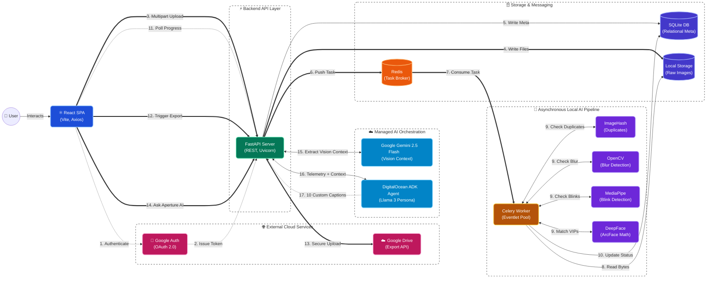

# ✨ Smart Photo Curator & Aperture AI

An enterprise-grade, AI-powered SaaS application designed to automate the grueling process of event photo culling. Upload massive raw event folders, and the local AI pipeline will automatically group burst shots, reject blurry photos, detect blinks, and isolate specific VIPs.

Once curated, users can chat with **Aperture**, a fully-managed DigitalOcean Agent that uses Vision AI and mathematical telemetry to generate hyper-contextual social media captions.

## 🏆 Powered by DigitalOcean Gradient™ AI & ADK

*Built for the DigitalOcean AI Hackathon*

We moved beyond basic API calls by building a **Multi-Agent Orchestration Pipeline**:

1. **The Vision Module:** We route the best curated photo from an album to Google's Gemini 2.5 Flash Vision model. Gemini uses the image and the specific `Album Name` to generate a highly accurate textual representation of the event's lighting, mood, location, and subjects.
2. **The ADK Agent:** We built the "Aperture Persona" as a **Fully-Managed Agent** hosted on DigitalOcean using their Agent Development Kit (ADK) and Llama 3 Instruct (8B).
3. **The Orchestration:** Our FastAPI backend injects the Gemini visual context, the user's real Google Account name, and our local OpenCV mathematical telemetry directly into the DO Agent. Aperture then streams back 6 highly specific, visually-aware social media captions via a beautifully animated UI.

---

## 🚀 Core Features

* **Multi-Agent Orchestration (Aperture AI):** Combines Google Gemini Vision with a DigitalOcean Managed Agent to generate contextual social media copy based on album names, visual data, and cull statistics.
* **Intelligent Photo Culling:** Automatically detects and trashes out-of-focus images using OpenCV Laplacian variance.
* **Blink Detection:** Utilizes Google's MediaPipe Face Landmarker to calculate Eye Aspect Ratios (EAR) and reject photos where subjects have their eyes closed.
* **Burst Duplicate Removal:** Uses Perceptual Hashing (pHash) to group visually identical burst shots and automatically selects the sharpest frame to keep.
* **VIP Facial Recognition:** Drop reference selfies and assign them custom names in the UI. The system uses DeepFace (ArcFace embeddings) to calculate exact Cosine Distances, strictly isolating target individuals in group photos.
* **Secure Google Authentication:** Fully authenticated user sessions using Google Identity Services and secure JSON Web Tokens (JWT).
* **Direct Google Drive Export:** Instantly push curated VIP and Keeper folders directly into the user's personal Google Drive using the Google Drive API.
* **Interactive Dark-Mode Dashboard:** A responsive, edge-to-edge React frontend featuring tabbed categorization, custom file-renaming on the fly, cascading CSS animations, and a cinematic manual-override lightbox.

---

## 🛠️ Tech Stack

**Frontend:**

* React.js (Vite)
* CSS3 (Custom Keyframe Animations & Glassmorphism)
* Google OAuth 2.0 (`@react-oauth/google`)

**Backend:**

* Python 3.10+ & FastAPI
* SQLAlchemy (SQLite for MVP, highly scalable)
* PyJWT (Security)

**Asynchronous Task Queue:**

* Celery
* Redis (Message Broker)

**AI & Machine Learning Pipeline:**

* **DigitalOcean Agent Development Kit (ADK):** Hosted Llama 3 (8B) Microservice
* **Google Generative AI:** Gemini 1.5 Flash (Vision context)
* **DeepFace:** Facial Embeddings
* **MediaPipe:** Face Mesh / Landmarks
* **OpenCV & ImageHash:** Mathematical telemetry and sharpness scoring

---

## 📋 Prerequisites

Before running this application locally, ensure you have the following installed:

* [Node.js](https://nodejs.org/) (v18+)
* [Python](https://www.python.org/) (3.10+)
* [Redis](https://redis.io/) (If on Windows, use WSL, Docker, or Memurai)
* A Google Cloud Project with an **OAuth Client ID** and the **Google Drive API** enabled.
* A **DigitalOcean** account with the Agent Platform preview enabled.

---

## ⚙️ Installation & Setup

### 1. Environment Variables (`.env`)

Create a `.env` file inside your `photo_backend` directory and add your API keys:

```env
GEMINI_API_KEY=your_google_ai_studio_key_here

```

*(Note: Your DigitalOcean Agent URL and Access Key are configured securely in your `main.py` routing logic).*

### 2. Backend Setup

Open a terminal in your backend directory:

```bash
# Create and activate a virtual environment
python -m venv venv

# Windows:
venv\Scripts\activate
# Mac/Linux:
source venv/bin/activate

# Install all required Python packages
python -m pip install fastapi uvicorn sqlalchemy celery redis opencv-python imagehash pillow mediapipe deepface google-auth google-api-python-client PyJWT pydantic python-multipart google-generativeai openai requests

```

### 3. Frontend Setup

Open a separate terminal in your frontend directory:

```bash
# Install Node modules
npm install
npm install @react-oauth/google axios

```

---

## 🏃‍♂️ Running the Application Locally

To run the full stack, you will need **four** separate terminal windows running simultaneously.

**Terminal 1: Start Redis**
*(Make sure your Redis server is running on default port 6379)*

```bash
redis-server

```

**Terminal 2: Start the FastAPI Backend**

```bash
# Ensure your virtual environment is activated!
python -m uvicorn main:app --reload

```

**Terminal 3: Start the Celery AI Worker**

```bash
# Ensure your virtual environment is activated!
# (If on Windows, you must use the eventlet or solo pool)
python -m pip install eventlet
celery -A worker.celery_app worker --loglevel=info -P eventlet

```

**Terminal 4: Start the React Frontend**

```bash
npm run dev

```

Finally, open your browser and navigate to `http://localhost:5173`.

---

## 🏗️ Architecture & Cloud Roadmap

Currently, this application uses a local SQLite `.db` file and local storage (`uploads/` directory) for rapid prototyping and MVP testing. The AI Agent logic is decoupled and hosted as a managed microservice on DigitalOcean.

**To fully deploy this to a production cloud environment:**

1. **Database:** Swap the SQLite connection string in `database.py` to a managed DigitalOcean PostgreSQL database.
2. **Storage:** Update the API and Worker to stream incoming photos to DigitalOcean Spaces (S3-compatible object storage) instead of the local filesystem.
3. **Workers:** Deploy the FastAPI backend and multiple stateless Celery worker nodes using DigitalOcean App Platform to process concurrent user uploads simultaneously.

---


