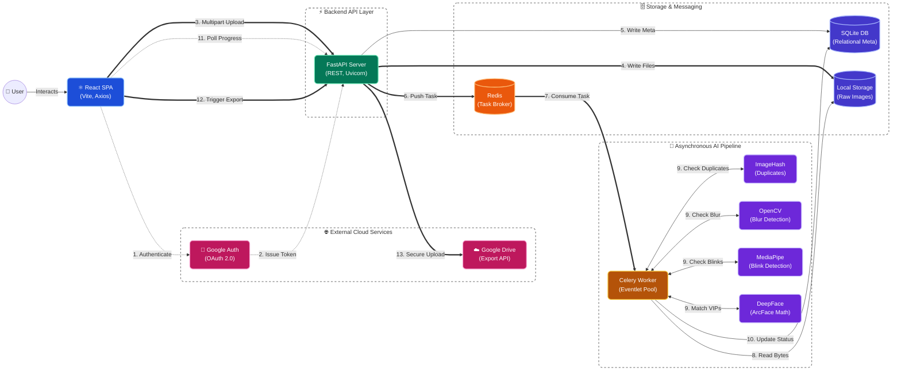

# ✨ Smart Photo Curator AI

An enterprise-grade, AI-powered SaaS application designed to automate the grueling process of photo culling. Upload massive raw event folders, and the AI will automatically group burst shots, reject blurry photos, detect blinks, and isolate specific VIPs using advanced facial recognition.

## 🚀 Features

* **Intelligent Photo Culling:** Automatically detects and trashes out-of-focus images using OpenCV Laplacian variance.
* **Blink Detection:** Utilizes Google's MediaPipe Face Landmarker to calculate Eye Aspect Ratios (EAR) and reject photos where subjects have their eyes closed.
* **Burst Duplicate Removal:** Uses Perceptual Hashing (pHash) to group visually identical burst shots and automatically selects the sharpest frame to keep.
* **VIP Facial Recognition:** Upload reference selfies, and the system will use DeepFace (ArcFace embeddings) to calculate exact Cosine Distances, strictly isolating target individuals in group photos.
* **Secure Google Authentication:** Fully authenticated user sessions using Google Identity Services and secure JSON Web Tokens (JWT).
* **Direct Google Drive Export:** Instantly push curated VIP and Keeper folders directly into the user's personal Google Drive using the Google Drive API.
* **Interactive Dark-Mode Dashboard:** A responsive, edge-to-edge React frontend featuring tabbed categorization, live background processing progress bars, and a cinematic manual-override lightbox.

---

## 🛠️ Tech Stack

**Frontend:**
* React.js (Vite)
* Axios
* Google OAuth 2.0 (`@react-oauth/google`)

**Backend:**
* Python 3 & FastAPI
* SQLAlchemy (SQLite for MVP, highly scalable)
* PyJWT (Security)
* Google API Python Client

**Asynchronous Task Queue:**
* Celery
* Redis (Message Broker)

**AI & Machine Learning:**
* DeepFace (Facial Embeddings)
* MediaPipe (Face Mesh / Landmarks)
* OpenCV (Image Processing)
* ImageHash & PIL (Mathematical Hashing)

---

## 📋 Prerequisites

Before running this application locally, ensure you have the following installed:
* [Node.js](https://nodejs.org/) (v18+)
* [Python](https://www.python.org/) (3.9+)
* [Redis](https://redis.io/) (If on Windows, use WSL, Docker, or Memurai)
* A Google Cloud Project with an **OAuth Client ID** and the **Google Drive API** enabled.

---

## ⚙️ Installation & Setup

### 1. Google Cloud Configuration
1. Go to the [Google Cloud Console](https://console.cloud.google.com/).
2. Create a project and enable the **Google Drive API**.
3. Create an **OAuth Client ID** (Web Application) and set the Authorized JavaScript origin to `http://localhost:5173`.
4. Copy your Client ID. Paste it into your `App.jsx` and `main.py` files where indicated.
5. *Note: Keep your OAuth consent screen in "Testing" mode and add your testing email addresses manually until you are ready for a public launch.*

### 2. Backend Setup
Open a terminal in your backend directory:

```bash
# Create and activate a virtual environment
python -m venv venv
# Windows:
venv\Scripts\activate
# Mac/Linux:
source venv/bin/activate

# Install all required Python packages
pip install fastapi uvicorn sqlalchemy celery redis opencv-python imagehash pillow mediapipe deepface google-auth google-api-python-client PyJWT pydantic python-multipart

```

### 3. Frontend Setup

Open a separate terminal in your frontend directory:

```bash
# Install Node modules
npm install
npm install @react-oauth/google axios

```

---

## 🏃‍♂️ Running the Application Locally

To run the full stack, you will need **four** separate terminal windows running simultaneously.

**Terminal 1: Start Redis**
*(Make sure your Redis server is running on default port 6379)*

```bash
redis-server

```

**Terminal 2: Start the FastAPI Backend**

```bash
# Ensure your virtual environment is activated!
uvicorn main:app --reload

```

**Terminal 3: Start the Celery AI Worker**

```bash
# Ensure your virtual environment is activated!
# (If on Windows, you must use the eventlet or solo pool)
pip install eventlet
celery -A worker.celery_app worker --loglevel=info -P eventlet

```

**Terminal 4: Start the React Frontend**

```bash
npm run dev

```

Finally, open your browser and navigate to `http://localhost:5173`.

---

## 🏗️ Architecture & Cloud Roadmap

Currently, this application uses a local SQLite `.db` file and local storage (`uploads/` directory) for rapid prototyping and MVP testing.

**To deploy this to a production cloud environment (AWS, Render, DigitalOcean):**

1. **Database:** Swap the SQLite connection string in `database.py` to a managed PostgreSQL database URL.
2. **Storage:** Update the API and Worker to stream incoming photos to an AWS S3 Bucket instead of the local filesystem.
3. **Workers:** Deploy multiple stateless Celery worker nodes to process concurrent user uploads simultaneously.

---


